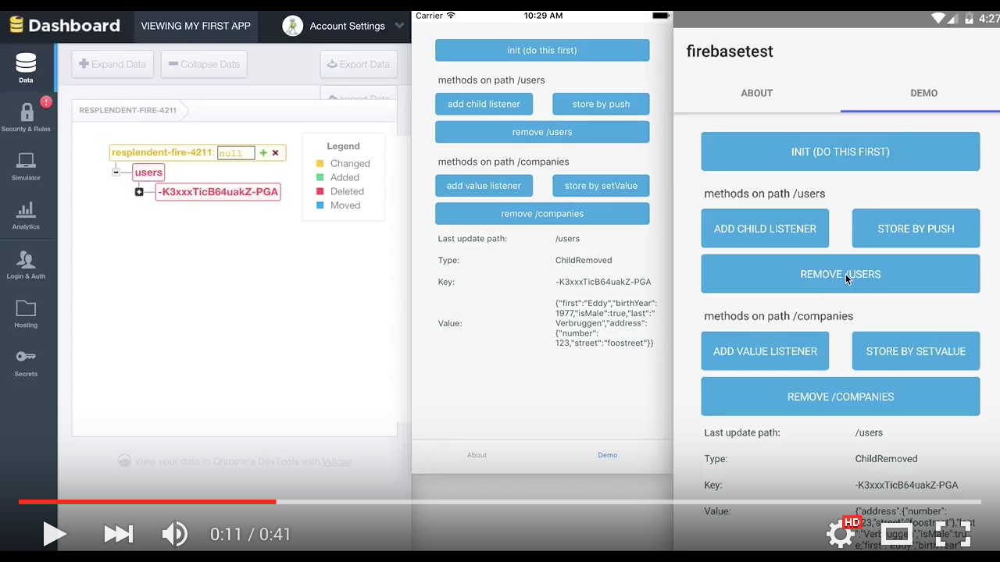

# NativeScript Firebase plugin

<br/>
Google's realtime app platform (Database, Authentication, Configuration, Notifications) [firebase.google.com](https://firebase.google.com/)


If you can spare 41 seconds, check this plugin's [demo app](https://github.com/EddyVerbruggen/nativescript-plugin-firebase-demo) in action:
[](https://youtu.be/7zYU5e0Djkw "YouTube demo, 41 sec")

### Use when
* you need to store JSON data in the cloud (but don't want to loose data when the device is offline),
* you want to sync that data to other devices and platforms,
* you want to optionally protect that data by having users log in,
* you want to update clients at the moment the data changes (think chat and multiplayer games),
* you want an easy way to remotely configure app features,
* you want push notifications.

## Prerequisites
Head on over to [https://console.firebase.google.com/](https://console.firebase.google.com/) and sign up for a free account.
Your first 'Firebase' will be automatically created and made available via an URL like `https://n-plugin-test.firebaseio.com`.

Open your Firebase project at the Google console and click 'Add app' to add an iOS and / or Android app. Follow the steps (make sure the bundle id is the same as your `nativescript.id` in `package.json` and you'll be able to download:

* iOS: `GoogleService-Info.plist` which you'll add to your NativeScript project at `app/App_Resources/iOS/GoogleService-Info.plist`

* Android: `google-services.json` which you'll add to your NativeScript project at `platforms/android/google-services.json`

## Installation
From the command prompt go to your app's root folder and execute:

```
tns plugin add nativescript-plugin-firebase
```

### Android
Install packages 'Google Play Services' and 'Google Repository' in your [Android SDK Manager](http://stackoverflow.com/a/37310513)

#### Open `app/App_Resources/Android/app.gradle`
- Add `applicationId "com.example.app"` to the `defaultConfig` node (change the id to the same as in your app's `package.json`), so it becomes:

```
android {
    ...
    defaultConfig {
        applicationId "com.example.app"
        ...
    }
}
```

#### Open `platforms/android/build.gradle`
- Near the top there's a dependencies section, add `classpath "com.google.gms:google-services:3.0.0"` so it becomes something like:
```
  dependencies {
    classpath "com.android.tools.build:gradle:1.5.0"
    classpath "com.google.gms:google-services:3.0.0"
  }
```
- Add the very bottom of the same file add `apply plugin: "com.google.gms.google-services"`

## Usage

If you want a quickstart, [clone our demo app (an older version is used in the YouTube video)](https://github.com/EddyVerbruggen/nativescript-plugin-firebase-demo).

### init
```js
  var firebase = require("nativescript-plugin-firebase");

  firebase.init({
    // Optionally pass in properties for database, authentication and cloud messaging,
    // see their respective docs.
  }).then(
      function (instance) {
        console.log("firebase.init done");
      },
      function (error) {
        console.log("firebase.init error: " + error);
      }
  );
```

All further examples assume `firebase` has been required.

Also, all functions support promises, but we're leaving out the `.then()` stuff for brevity where it doesn't add value.

## Features
For readability the supported features have been moved to their own README's:

* [Realtime Database](docs/DATABASE.md)
* [Authentication](docs/AUTHENTICATION.md)
* [Remote Config](docs/REMOTECONFIG.md)
* [Cloud Messaging](docs/MESSAGING.md)


## Known issues on Android

#### DexIndexOverflowException
```
com.android.dex.DexIndexOverflowException: method ID not in..
```

Congrats, you ran into [this issue](https://github.com/NativeScript/android-runtime/issues/344)
which can be solved by adding `multiDexEnabled true` to your `app/App_Resources/Android/app.gradle`
so it becomes something like this:

```
android {  
  defaultConfig {  
    applicationId "my.package.id"
    multiDexEnabled true
    generatedDensities = []
  }  
  aaptOptions {  
    additionalParameters "--no-version-vectors"  
  }  
}
```

#### java.lang.OutOfMemoryError: GC overhead limit exceeded

Increase the Java Max Heap Size like this (the bit at the end):

```
android {  
  defaultConfig {  
    applicationId "my.package.id"
    multiDexEnabled true
    generatedDensities = []
  }
  aaptOptions {  
    additionalParameters "--no-version-vectors"  
  }
  dexOptions {
    javaMaxHeapSize "4g"
  }
}
```

#### FirebaseApp with name [DEFAULT] doesn't exist
Another possible error is "FirebaseApp with name [DEFAULT] doesn't exist." which will be solved by
placing `google-services.json` to `platforms/android/google-services.json` (see above), and making
the changes to `build.gradle` which are mentioned above as well.

#### Could not find com.google...
And there's this one: "Could not find com.google.firebase:firebase-auth:9.0.2". That means
making sure you have the latest Google Repository bits installed.
Just run `android` from a command prompt and install any pending updates.

#### Found play-services:9.0.0, but version 9.0.2 is needed..
Update your Android bits like the issue above and reinstall the android platform in your project.

## Future work
- Add support for `removeEventListener`
- Possibly add more login mechanisms
- Add other Firebase 3.x SDK features (there's already a few feature requests in the GitHub issue tracker

## Credits
The starting point for this plugin was [this great Gist](https://gist.github.com/jbristowe/c89a7bcae7fc9a035ee7) by [John Bristowe](https://github.com/jbristowe).
