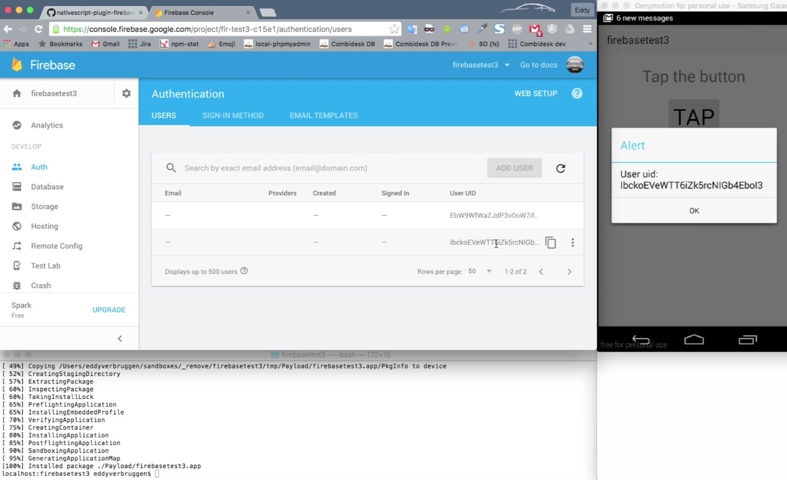

# NativeScript Firebase plugin

[![Build Status][build-status]][build-url]
[![NPM version][npm-image]][npm-url]
[![Downloads][downloads-image]][npm-url]
[![Twitter Follow][twitter-image]][twitter-url]

[build-status]:https://travis-ci.org/EddyVerbruggen/nativescript-plugin-firebase.svg?branch=master
[build-url]:https://travis-ci.org/EddyVerbruggen/nativescript-plugin-firebase
[npm-image]:http://img.shields.io/npm/v/nativescript-plugin-firebase.svg
[npm-url]:https://npmjs.org/package/nativescript-plugin-firebase
[downloads-image]:http://img.shields.io/npm/dm/nativescript-plugin-firebase.svg
[twitter-image]:https://img.shields.io/twitter/follow/eddyverbruggen.svg?style=social&label=Follow%20me
[twitter-url]:https://twitter.com/eddyverbruggen

<br/>

## Features
* [Realtime Database](docs/DATABASE.md)
* [Firestore](docs/FIRESTORE.md)
* [Authentication](docs/AUTHENTICATION.md)
* [Remote Config](docs/REMOTECONFIG.md)
* [Cloud Messaging](docs/MESSAGING.md)
* [Storage](docs/STORAGE.md)
* [Crash Reporting](docs/CRASHREPORTING.md)
* [Analytics](docs/ANALYTICS.md)
* [Invites and Dynamic Links](docs/INVITES_DYNAMICLINKS.md)
* [AdMob](docs/ADMOB.md)

## Prerequisites
Head on over to [https://console.firebase.google.com/](https://console.firebase.google.com/) and sign up for a free account.
Your first 'Firebase' will be automatically created and made available via an URL like `https://n-plugin-test.firebaseio.com`.

Open your Firebase project at the Google console and click 'Add app' to add an iOS and / or Android app. Follow the steps (make sure the bundle id is the same as your `nativescript.id` in `package.json` and you'll be able to download:

* iOS: `GoogleService-Info.plist` which you'll add to your NativeScript project at `app/App_Resources/iOS/GoogleService-Info.plist`

* Android: `google-services.json` which you'll add to your NativeScript project at `app/App_Resources/Android/google-services.json`

## Installation
If you rather watch a (slightly outdated) video explaining the steps then check out this step-by-step guide - you'll also learn how to
add iOS and Android support to the Firebase console and how to integrate anonymous authentication:
[](https://youtu.be/IextEpoIzwE "YouTube demo")

From the command prompt go to your app's root folder and execute:

```bash
tns plugin add nativescript-plugin-firebase
```

This will launch an install script which will guide you through installing additional components.
Check the doc links above to see what's what. You can always change your choices later.

### Config
If you choose to save your config during the installation, the supported options may be saved in the `firebase.nativescript.json` at the root of your app.
This is to ensure your app may roundtrip source control and installation on CI won't prompt for user input during installation.

You can reconfigure the plugin by going to the `node_modules/nativescript-plugin-firebase` and running `npm run config`.

You can also change the configuration by deleting the `firebase.nativescript.json` and reinstalling the plugin.

### iOS (Cocoapods)
The Firebase iOS SDK is installed via Cocoapods, so run `pod repo update` from the command prompt (in any folder) to ensure you have the latest spec.

#### Google Play Services Version
The plugin will default to [this version](https://github.com/EddyVerbruggen/nativescript-plugin-firebase/blob/master/src/platforms/android/include.gradle#L27) of the Android `play-services-base` SDK.
If you need to change the version (to for instance the latest version), you can add a project ext property `googlePlayServicesVersion` to `app/App_Resources/Android/app.gradle`:

```
project.ext {
    googlePlayServicesVersion = "+"
}
```

## Usage

### Demo app
If you want a quickstart, clone the repo, `cd src`, and `npm run demo.ios` or `npm run demo.android`.

### Start-up wiring
We need to do some wiring when your app starts, so open `app.js` and add this before `application.start();`:

##### JavaScript
```js
var firebase = require("nativescript-plugin-firebase");

firebase.init({
  // Optionally pass in properties for database, authentication and cloud messaging,
  // see their respective docs.
}).then(
    function (instance) {
      console.log("firebase.init done");
    },
    function (error) {
      console.log("firebase.init error: " + error);
    }
);
```

#### TypeScript
```js
const firebase = require("nativescript-plugin-firebase");

firebase.init({
  // Optionally pass in properties for database, authentication and cloud messaging,
  // see their respective docs.
}).then(
  instance => {
    console.log("firebase.init done");
  },
  error => {
    console.log(`firebase.init error: ${error}`);
  }
);
```

## Known issues on iOS

#### Trouble running on the simulator
Open or create `App_Resources/iOS/<appname>.entitlements` and add these two keys with the value `true`:

```xml
<?xml version="1.0" encoding="UTF-8"?>
<!DOCTYPE plist PUBLIC "-//Apple//DTD PLIST 1.0//EN" "http://www.apple.com/DTDs/PropertyList-1.0.dtd">
<plist version="1.0">
<dict>
    <key>com.apple.keystore.access-keychain-keys</key>
    <true/>
    <key>com.apple.keystore.device</key>
    <true/>
</dict>
</plist>
```

#### Authentication failed: invalid_token
On the simulator you may see this message if you have more than one app with the Firebase SDK ever installed:

```
[FirebaseDatabase] Authentication failed: invalid_token (Invalid claim 'aud' in auth token.)
or
[FirebaseDatabase] Authentication failed: invalid_token (audience was project 'firegroceries-904d0' but should have been project 'your-firebase-project')
```

This is [a known issue in the Firebase SDK](http://stackoverflow.com/questions/37857131/swift-firebase-database-invalid-token-error).
I always use a real device to avoid this problem, but you can pass an 'iOSEmulatorFlush' option to init.
```
firebase.init({
  // Optionally pass in properties for database, authentication and cloud messaging,
  // see their respective docs and 'iOSEmulatorFlush' to flush token before init.
  iOSEmulatorFlush: true
}).then()
```

#### Pod dependency error
If you see an error like `Unable to satisfy the following requirements: Firebase (~> 3.17.0) required by Podfile`,
then run `pod repo update` on the command line to make sure you have the latest Podspec.

This could happen when updating the plugin to a new version. You'll want to `tns platform remove ios && tns platform add ios` as well to clean out the old pod version.

## Known issues on Android

#### Genymotion
You can use the awesome [Genymotion emulator](https://www.genymotion.com/)
but you'll need to [install Google Play Services on it](https://inthecheesefactory.com/blog/how-to-install-google-services-on-genymotion/en) or you'll run into errors during authentication.

#### DexIndexOverflowException
```
com.android.dex.DexIndexOverflowException: method ID not in..
```

Congrats, you ran into [this issue](https://github.com/NativeScript/android-runtime/issues/344)
which can be solved by adding `multiDexEnabled true` to your `app/App_Resources/Android/app.gradle`
so it becomes something like this:

```
android {  
  defaultConfig {  
    applicationId = "__PACKAGE__"  
    multiDexEnabled true
    generatedDensities = []
  }  
  aaptOptions {  
    additionalParameters "--no-version-vectors"  
  }  
}
```

#### java.lang.OutOfMemoryError: GC overhead limit exceeded

Increase the Java Max Heap Size like this (the bit at the end):

```
android {  
  defaultConfig {  
    applicationId = "__PACKAGE__"  
    multiDexEnabled true
    generatedDensities = []
  }
  aaptOptions {  
    additionalParameters "--no-version-vectors"  
  }
  dexOptions {
    javaMaxHeapSize "4g"
  }
}
```

#### FirebaseApp with name [DEFAULT] doesn't exist
Another possible error is "FirebaseApp with name [DEFAULT] doesn't exist." which will be solved by
placing `google-services.json` to `platforms/android/google-services.json` (see above), and making
the changes to `build.gradle` which are mentioned above as well.

#### Errors regarding API level 26.0.0
Update your local Android SDKs:

Just run `$ANDROID_HOME/tools/bin/sdkmanager --update` from a command prompt
or launch the SDK manager from Android Studio, expand `Extras` and install any pending updates.

#### Found play-services:10.A.B, but version 11.X.Y is needed..
Update your Android bits like the issue above and reinstall the android platform in your project.

#### `include.gradle`: Failed to apply plugin .. For input string: "+"
You probably have another plugin depending on Google Play Services (Google Maps, perhaps).
We need to pin to a specific play services version to play nice with others, so open `app/App_Resources/Android/app.gradle` and add:

```
android {  
  // other stuff here

  project.ext {
    googlePlayServicesVersion = "11.8.0"
  }
}
```

Where `"11.8.0"` is best set to the same value as the `firebaseVersion` value in [this file](https://github.com/EddyVerbruggen/nativescript-plugin-firebase/blob/master/src/platforms/android/include.gradle).
