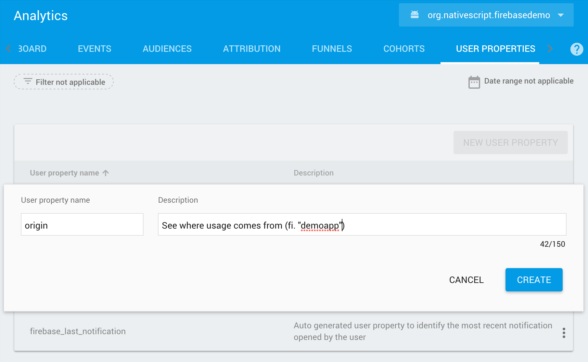

## Enabling Analytics
This plugin has had enalytics enabled since day 1 to collect usage and behavior data for your app,
and since version 3.6.0 you are able to push your own events.

With version 10.0.0 I've been able to make Analytics an optional dependency (because the upstream SDKs made it optional as well),
so if you want to use Analytics then nothing needs to change (enabled by default), but if you don't, you can edit `firebase.nativescript.json`
and add `"analytics": false`, then `rm -rf node_modules platforms`.

_Beware that your Analytics events in the Firebase console dashboards are updated periodically throughout the day, not real-time._

## Functions

### analytics.setScreenName
By default Firebase will log the classname, but since all your NativeScript screens run inside the same `UIViewController` (iOS) / `Activity` (Android),
the screenlogs won't be of much use. That's where this function comes in. Simply call `setScreenName` on every page your app routes to.

```js
  firebase.analytics.setScreenName({
    screenName: "User settings"
  }).then(
      function () {
        console.log("Screen name set");
      }
  );
```

### analytics.logEvent
Events can be used to analyze what is happening in your app, such as user actions, system events, or errors.

Analytics automatically logs [some events](https://support.google.com/firebase/answer/6317485) for you; you don't need to add any code to receive them. If your app needs to collect additional data, you can log up to 500 different Analytics Event types in your app. There is no limit on the total volume of events your app logs.

For a list of predefined Events [check this Android reference](https://firebase.google.com/docs/reference/android/com/google/firebase/analytics/FirebaseAnalytics.Event.html). Just copy the String values - these are also available on iOS.

```js
  firebase.analytics.logEvent({
    key: "add_to_cart",
    parameters: [ // optional
      {
        key: "item_id",
        value: "p7654"
      },
      {
        key: "item_name",
        value: "abc"
      }]
  }).then(
      function () {
        console.log("Firebase Analytics event logged");
      }
  );
```

### analytics.logComplexEvent
Same thing as logEvent but you can add an `Array` or specific types (not just `string`).
See `LogComplexEventTypeParameter` for all available types.

```typescript
import * as firebase from "nativescript-plugin-firebase";
import { LogComplexEventTypeParameter } from "nativescript-plugin-firebase";

firebase.analytics.logComplexEvent({
  key: "view_item_list",
  parameters: [{
    key: "item1",
    type: "array",
    value: [
      {
        parameters: [
          {key: "item_id", value: "id of item", type: LogComplexEventTypeParameter.STRING},
          {key: "item_name", value: "name of item", type: LogComplexEventTypeParameter.STRING},
          {key: "price", value: 1, type: LogComplexEventTypeParameter.DOUBLE},
          {key: "index", value: 1, type: LogComplexEventTypeParameter.INT}
        ]
      },
      {
        parameters: [
          {key: "item_id", value: "id of item", type: LogComplexEventTypeParameter.STRING},
          {key: "item_name", value: "name of item", type: LogComplexEventTypeParameter.STRING},
          {key: "price", value: 1, type: LogComplexEventTypeParameter.DOUBLE},
          {key: "index", value: 2, type: LogComplexEventTypeParameter.INT}
        ]
      }
    ]
  }]
});
```

### analytics.setUserProperty
User properties are attributes you define to describe segments of your userbase, such as language preference or geographic location.

Analytics automatically logs [some user properties](https://support.google.com/firebase/answer/6317486); you don't need to add any code to enable them. If your app needs to collect additional data, you can set up to 25 different Analytics User Properties in your app.

You own properties need to be [preregistered with Firebase](https://support.google.com/firebase/answer/6317519?hl=en&ref_topic=6317489#create-property) before you can use them, so add a property for __all relevant platforms__ like this:




```js
  firebase.analytics.setUserProperty({
    key: "origin",
    value: "demoapp"
  }).then(
      function () {
        console.log("Analytics user property set");
      }
  );
```

### analytics.setUserId
Want to log a user ID with your analytics data? Go ahead:

```js
  firebase.analytics.setUserId({
    userId: "whatever-you-want"
  }).then(
      function () {
        console.log("Analytics userId set");
      }
  );
```

### analytics.setAnalyticsCollectionEnabled
By default Firebase collects analytics data. If you don't want this (or first get user consent),
you can disable/enable this at runtime:

```js
  firebase.analytics.setAnalyticsCollectionEnabled(false);
```

You can also pass this property during `init()`:

```typescript
  firebase.init({
    analyticsCollectionEnabled: false
  });
```

> If you want to disable collection without calling this function programmatically, then you can add a flag to your `App_Resources/iOS/Info.plist` and `App_Resources/Android/AndroidManifest.xml`, see [Firebase's documentation](https://firebase.google.com/support/guides/disable-analytics) for details.

### analytics.setSessionTimeoutDuration
Sets the duration of inactivity that terminates the current session. The default value is 1800 seconds (30 minutes).

```js
  firebase.analytics.setSessionTimeoutDuration(600); // 10 minutes
```
