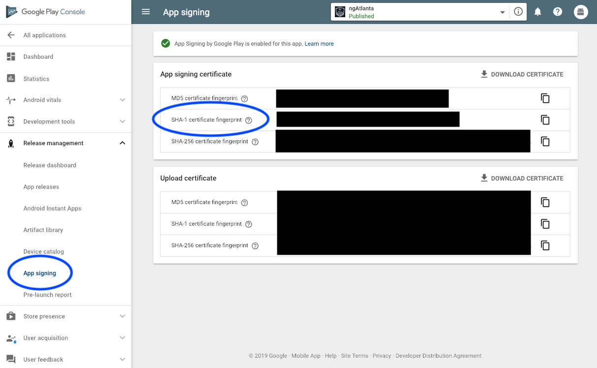

## Enabling Authentication
You can sign in a user either

* [anonymously](#anonymous-login),
* by [email and password](#email-password-login),
* by [email link](#email-link-login),
* by [phone verification](#phone-verification),
* using a [custom token](#custom-login),
* using [Facebook](#facebook-login),
* using [Google](#google-sign-in).

Each of these login mechanisms need to be enabled in your Firebase console at the 'Login & Auth' tab.

## What's returned when logged in?
All login functions below, as well as `getCurrentUser` return a 'User' object with these properties:

|param|optional|description
|---|---|---
|`uid`|no|The Firebase User ID
|`anonymous`|no|Whether or not the user logged in anonymously
|`emailVerified`|no|You can send an email with a verification link which this refers to
|`providers`|no|An array of {id: value} objects, where value can be 'facebook.com', etc
|`email`|yes|Not all providers require an email address
|`name`|yes|The name stored at the provider
|`profileImageURL`|yes|A string containing a link to a user image on the web
|`phoneNumber`|yes|The user's phone number
|`refreshToken`|yes|iOS only
|`additionalUserInfo`|no|See `AdditionalUserInfo` below
|`metadata`|no|See `UserMetadata` below

### `AdditionalUserInfo`

|param|optional|description
|---|---|---
|`profile`|yes|Any profile data the auth provider may supply. Type is `Map<string, any>`.
|`providerId`|no|The provider that was used to login this time. Example: `password` or `google.com`.
|`username`|yes|The username, usually `null`.
|`isNewUser`|no|Whether or not the user was just created.

### `UserMetadata`

|param|optional|description
|---|---|---
|`creationTimestamp`|no|Type is `Date`.
|`lastSignInTimestamp`|no|Type is `Date`.

## Functions
You can either use the Native API, or the Web API. It's just a matter of personal background or preference. Under the hood the implementations are identical.

You can also mix and match the API calls.

The relevant imports would be:

```typescript
const firebase = require("nativescript-plugin-firebase");
const firebaseWebApi = require("nativescript-plugin-firebase/app");
```

### Listening to auth state changes
As stated [here](https://firebase.google.com/docs/auth/ios/manage-users#get_the_currently_signed-in_user):

> The recommended way to get the current user is by setting a listener on the Auth object

To listen to auth state changes you can register a listener during `init`:

```js
  firebase.init({
    onAuthStateChanged: function(data) { // optional but useful to immediately re-logon the user when he re-visits your app
      console.log(data.loggedIn ? "Logged in to firebase" : "Logged out from firebase");
      if (data.loggedIn) {
        console.log("user's email address: " + (data.user.email ? data.user.email : "N/A"));
      }
    }
  });
```

If - for some reason - you want more control over the listener you can use these methods after you ran `init`:

```js
  // configure a listener:
  var listener = {
    onAuthStateChanged: function(data) {
      console.log(data.loggedIn ? "Logged in to firebase" : "Logged out from firebase");
      if (data.loggedIn) {
        console.log("User info", data.user);
      }
    },
    thisArg: this
  };

  // add the listener:
  firebase.addAuthStateListener(listener);
  
  // stop listening to auth state changes:
  firebase.removeAuthStateListener(listener);
  
  // check if already listening to auth state changes
  firebase.hasAuthStateListener(listener);
```

### Get Current User
Once the user is logged in you can retrieve the currently logged in user:

<details>
 <summary>Native API</summary>

```typescript
  firebase.getCurrentUser()
      .then(user => console.log("User uid: " + user.uid))
      .catch(error => console.log("Trouble in paradise: " + error));
```
</details>

<details>
 <summary>Web API</summary>

```typescript
  const user = firebaseWebApi.auth().currentUser;
```
</details>

### Fetch providers for email
Want to know which auth providers are associated with an emailaddress?

<details>
 <summary>Native API</summary>

```typescript
  const emailAddress = "someone@domain.com";
  firebase.fetchProvidersForEmail(emailAddress).then((providers: Array<string>) => {
    console.log(`Providers for ${emailAddress}: ${JSON.stringify(providers)}`);
  });
```
</details>

<details>
 <summary>Web API</summary>

```js
  const user = firebaseWebApi.auth().currentUser;
  if (!user || !user.email) {
    console.log("Can't fetch providers; no user with an emailaddress logged in.");
    return;
  }

  firebaseWebApi.auth().fetchProvidersForEmail(user.email)
      .then(result => console.log(`Providers for ${user.email}: ${JSON.stringify(result)}`))
      .catch(error => console.log("Fetch Providers for Email error: " + error));
```
</details>

### Fetch sign-in methods for email
Both email-password login and email-link login are `password` providers, so by just using `fetchProvidersForEmail`
you won't be able to differentiate between those login methods. That's where `fetchSignInMethodsForEmail` comes in.

<details>
 <summary>Native API</summary>

```typescript
  const emailAddress = "someone@domain.com";
  firebase.fetchSignInMethodsForEmail(emailAddress).then((methods: Array<string>) => {
    console.log(`Sign-in methods for ${emailAddress}: ${JSON.stringify(methods)}`);
  });
```
</details>

<details>
 <summary>Web API</summary>

```js
  const user = firebaseWebApi.auth().currentUser;
  if (!user || !user.email) {
    console.log("Can't fetch sign-in methods; no user with an emailaddress logged in.");
    return;
  }

  firebaseWebApi.auth().fetchSignInMethodsForEmail(user.email)
      .then(result => console.log(`Sign-in methods for ${user.email}: ${JSON.stringify(result)}`))
      .catch(error => console.log("Fetch Sign-in methods for Email error: " + error));
```
</details>

### Updating a profile
Pass in at least one of `displayName` and `photoURL`.
The logged in user will be updated, but for `getCurrentUser` to reflect the change you'll need to do a logout-login.

```js
  firebase.updateProfile({
    displayName: 'Eddy Verbruggen',
    photoURL: 'http://provider.com/profiles/eddyverbruggen.png'
  }).then(
      function () {
        // called when update profile was successful
      },
      function (errorMessage) {
        console.log(errorMessage);
      }
  );
```

### Anonymous login
Don't forget to enable anonymous login in your firebase instance.

<details>
 <summary>Native API</summary>

```typescript
  firebase.login(
      {
        type: firebase.LoginType.ANONYMOUS
      })
      .then(user => console.log("User uid: " + user.uid))
      .catch(error => console.log("Trouble in paradise: " + error));
```
</details>

<details>
 <summary>Web API</summary>

```typescript
  firebaseWebApi.auth().signInAnonymously()
      .then(() => console.log("User logged in"))
      .catch(err => console.log("Login error: " + JSON.stringify(err)));
```
</details>

### Email-Password login
Don't forget to enable email-password login in your firebase instance.

<details>
 <summary>Native API</summary>

```typescript
  firebase.login(
      {
        type: firebase.LoginType.PASSWORD,
        passwordOptions: {
          email: 'useraccount@provider.com',
          password: 'theirpassword'
        }
      })
      .then(result => JSON.stringify(result))
      .catch(error => console.log(error));
```
</details>

<details>
 <summary>Web API</summary>

```typescript
  firebaseWebApi.auth().signInWithEmailAndPassword('eddy@x-services.nl', 'firebase')
      .then(() => console.log("User logged in"))
      .catch(err => console.log("Login error: " + JSON.stringify(err)));
```
</details>


### Email-Link login
Enable email-password login in your firebase instance, and flip the "E-mail link" switch.

This login type allows your users to login without providing a password. They can simply click a link
and get redirected to the app. The app may even run on a different device.

Enable dynamic links, as described in the [Dynamic Links readme](./INVITES_DYNAMICLINKS.md), because the user
that receives the link will need to be redirected to your app.

#### iOS configuration
- Specify the bundle id of your app in the Firebase console.

#### Android configuration
- Specify the package name of your app in the Firebase console.
- Upload the SHA-1 and SHA-256 of the (debug) signing certificates to the Firebase console, as described in the [Dynamic Links readme](./INVITES_DYNAMICLINKS.md).
- Also add an `android:host` for the `emailLinkOptions.url` to your `app/App_Resources/Android/AndroidManifest.xml` file as described in that readme.

<details>
 <summary>Native API</summary>

```typescript
  firebase.login(
      {
        type: firebase.LoginType.EMAIL_LINK,
        emailLinkOptions: {
          email: "eddy@x-services.nl",
          url: "https://domain.com?foo=bar",
          // the stuff below is optional, if not set the plugin will infer this for you (bundle/package is taken from currently used platform)
          iOS: {
            bundleId: "my.bundle.id"
          },
          android: {
            packageName: "my.package.name"
          }
        }
      })
      .then(result => JSON.stringify(result))
      .catch(error => console.log(error));
```
</details>

<details>
 <summary>Web API</summary>

```typescript
  firebaseWebApi.auth().sendSignInLinkToEmail(
      "eddy@x-services.nl",
       {
         url: "https://domain.com?foo=bar",
         // the stuff below is optional, if not set the plugin will infer this for you (bundle/package is taken from currently used platform)
         iOS: {
           bundleId: "my.bundle.id"
         },
         android: {
           packageName: "my.package.name"
         }
       })
      .then(() => console.log("Email link sent"))
      .catch(err => console.log("Login error: " + JSON.stringify(err)));
```
</details>


#### Managing email-password accounts

##### Creating a Password account
This may not work on an (Android) simulator. See #463.

<details>
 <summary>Native API</summary>

```js
  firebase.createUser({
    email: 'eddyverbruggen@gmail.com',
    password: 'firebase'
  }).then(
      function (user) {
        dialogs.alert({
          title: "User created",
          message: "email: " + user.email,
          okButtonText: "Nice!"
        })
      },
      function (errorMessage) {
        dialogs.alert({
          title: "No user created",
          message: errorMessage,
          okButtonText: "OK, got it"
        })
      }
  );
```
</details>

<details>
 <summary>Web API</summary>

```typescript
  firebaseWebApi.auth().createUserWithEmailAndPassword('eddyverbruggen@gmail.com', 'firebase')
      .then((user: User) => {
        console.log("User created: " + JSON.stringify(user));
      })
      .catch(error => console.log("Error creating user: " + error));
```
</details>


#### Resetting a password
```js
  firebase.resetPassword({
    email: 'useraccount@provider.com'
  }).then(
      function () {
        // called when password reset was successful,
        // you could now prompt the user to check his email
      },
      function (errorMessage) {
        console.log(errorMessage);
      }
  );
```

#### Changing a password
Note that changing a password may fail if your login for this `email` was too long ago (per Firebase's standards, whatever they are).

```js
  firebase.changePassword({
    email: 'useraccount@provider.com',
    oldPassword: 'myOldPassword',
    newPassword: 'myNewPassword'
  }).then(
      function () {
        // called when password change was successful
      },
      function (errorMessage) {
        console.log(errorMessage);
      }
  );
```

### Phone Verification
* Don't forget to enable Phone login in your firebase instance.
* You can only test this on a real device (not on an emulator/simulator).
* Use the phone number of the device you're testing on.
* _ANDROID:_ [Make sure you've uploaded your SHA1 fingerprints](https://developers.google.com/android/guides/client-auth) to the Firebase console, then download the latest `google-services.json` file and add it to `app/App_Resources/Android`.
* _iOS:_ Make sure you have messaging enabled as well, as this uses push notifications on iOS.

```js
  firebase.login({
    type: firebase.LoginType.PHONE,
    phoneOptions: {
      phoneNumber: '+12345678900',
      verificationPrompt: "The received verification code" // default "Verification code"
    }
  }).then(
      function (result) {
        JSON.stringify(result);
      },
      function (errorMessage) {
        console.log(errorMessage);
      }
  );
```


### Custom login
Use this login type to authenticate against firebase using a token generated by your own backend server. See these [instructions on how to generate the authentication token](https://firebase.google.com/docs/auth/server).

```js
  var token = "myBackendToken";

  firebase.login({
    type: firebase.LoginType.CUSTOM,
    customOptions: {
      token: token
    }
  }).then(
      function (result) {
        JSON.stringify(result);
      },
      function (errorMessage) {
        console.log(errorMessage);
      }
  );
```

### Facebook login

First, enable Facebook login in your Firebase instance and add the App-ID and App-Secret.

Then add the following lines to your code and check for setup instructions for your platform below.

```js
  firebase.login({
    type: firebase.LoginType.FACEBOOK,
    // Optional
    facebookOptions: {
      // defaults to ['public_profile', 'email']
      scope: ['public_profile', 'email']
    }
  }).then(
      function (result) {
        JSON.stringify(result);
      },
      function (errorMessage) {
        console.log(errorMessage);
      }
  );
```

For a complete list of the available scope permissions, visit Facebook's documentation: https://developers.facebook.com/docs/facebook-login/permissions. 

#### Post-login Graph API querying
Upon successful authentication, Facebook creates an access token that can be obtained from the login method's result object. This access token can then be used for querying the Facebook Graph API, by feeding it to either Facebook's Javascript SDK or their iOS/Android native SDKs:

```js
"providers": [
         {
             "id": "facebook.com",
             "token": "<FB token>"
         }
     ]
```

#### iOS
 1. If you didn't choose this feature during installation you can open the `Podfile` in the plugin's `platforms/ios` folder and uncomment the Facebook line.
 2. Add a bit of config to `app\App_Resources\iOS\Info.plist` as instructed in Step 4 [here](https://developers.facebook.com/docs/ios/getting-started). Facebook login works perfectly on the demo app, so if you can't get it working, make sure to check out the [demo app's config](https://github.com/EddyVerbruggen/nativescript-plugin-firebase-demo/blob/ad85e187dbbb12ef0e705d1bfaed90c702846bc4/Firebase/app/App_Resources/iOS/Info.plist).

#### Android

1. If you didn't choose this feature during installation you can uncomment the facebook SDK in `node_modules\nativescript-plugin-firebase\platforms\android\include.gradle`
2. Add `<meta-data android:name="com.facebook.sdk.ApplicationId" android:value="@string/facebook_app_id"/>` to the `manifest/application tag` in `app\App_Resources\Android\AndroidManifest.xml`, so it becomes similar to this:

   ```xml
   	<application
   		android:name="com.tns.NativeScriptApplication"
   		..>
   		
   		<meta-data android:name="com.facebook.sdk.ApplicationId" android:value="@string/facebook_app_id"/>
   
   		<activity
   			android:name="com.tns.NativeScriptActivity"
   			..>
   ```
   
3. Create a file `facebooklogin.xml`. Depending on your project structure this either goes into `App_Resources/Android/values/` or `App_Resources/Android/src/main/res/values/`. Add this to the file (replace the id):

   ```xml
   <?xml version='1.0' encoding='utf-8'?>
   <resources>
        <string name="facebook_app_id">126035687816994</string>
   </resources>
   ```
4. In your Facebook dev console, go to the Basic settings and add the Android platform if you haven't already. Then set the 'Google Play Packagename' to your applicationId (see your `package.json`) and set 'Classname' to `com.tns.NativeScriptActivity`.
5. Set the Key-Hash as well. If you don't know it you can try Facebook login in your app and observe the `adb logcat` output for something like `Key hash <......> does not match any stored key hashes.` 

### Google Sign-In

First, enable Google Sign-In in your firebase instance and add the _Web SDK configuration_.

Make sure you've uploaded your [SHA1 fingerprints](https://developers.google.com/android/guides/client-auth) to the Firebase console, then download the latest `google-services.json` file and add it to `app/App_Resources/Android`.

> **Uploading your SHA1 fingerprint is required for _debug_ and _release_ builds.**

> If you have enabled Google Play's _App Signing_ feature you will need to add the SHA1 for Google's signing certificate to your Firebase project's fingerprints. If you fail to do this, your release builds will fail because they were not signed by Google. See image below:
>
> 

Then add the following lines to your code and check for setup instructions for your platform below.

```js
  firebase.login({
    type: firebase.LoginType.GOOGLE,
    // Optional 
    googleOptions: {
      hostedDomain: "mygsuitedomain.com"
    }
  }).then(
      function (result) {
        JSON.stringify(result);
      },
      function (errorMessage) {
        console.log(errorMessage);
      }
  );
```

#### Google Access Token
Upon successful authentication, Google creates an access token that can be obtained from the login method's result object. This access token can then be used for Google API:

```js
"providers": [
         {
             "id": "google.com",
             "token": "<Google Access Token>"
         }
     ]
```

#### iOS
If you didn't choose this feature during installation you can open the `Podfile` in the plugin's `platforms/ios` folder and uncomment the `GoogleSignIn` line.
 
Make sure the URL Scheme for `REVERSED_CLIENT_ID` is in `app/App_Resources/iOS/Info.plist`:
 
```xml
	<key>CFBundleURLTypes</key>
	<array>
		<dict>
			<key>CFBundleTypeRole</key>
			<string>Editor</string>
			<key>CFBundleURLName</key>
			<string>REVERSED_CLIENT_ID</string>
			<key>CFBundleURLSchemes</key>
			<array>
				<string>com.googleusercontent.apps.1052836194035-l81fsjai1u40ocnqjcpnoebnnsltt03b</string>
			</array>
		</dict>
	</array>
```

*NOTE:* iOS 10 and below issue for Google Auth when opening from a modal.

If you are planning to open Google Auth from a modal view you may encounter this error resulting in nothing happening (no google auth dialog) on iOS 10 and below:

```
Warning: Attempt to present <SFSafariViewController: 0x7fa575968470> on <UILayoutViewController: 0x7fa575e3d710> whose view is not in the window hierarchy!
```

To solve, you will want to pass in the appropriate iOS controller of the active view. This can be accomplished as follows:

```js
  firebase.login({
    type: firebase.LoginType.GOOGLE,
    ios: {
      controller: topmost().ios.controller
    }
  }).then(
      function (result) {
        JSON.stringify(result);
      },
      function (errorMessage) {
        console.log(errorMessage);
      }
  );
```

#### Android

1. If you didn't choose this feature during installation you can uncomment `google-services-auth` in `node_modules\nativescript-plugin-firebase\platforms\android\include.gradle`
2. Google Sign-In requires an SHA1 fingerprint: see [Authenticating Your Client for details](https://developers.google.com/android/guides/client-auth). If you don't do this you will see the account selection popup, but you won't be able to actually sign in.
3. Those fingerprints need to be added to your Firebase console. Go to 'project overview', 'project settings', then scroll down a bit.

### getAuthToken
If you want to authenticate your user from your backend server you can obtain
a Firebase auth token for the currently logged in user.

```js
  firebase.getAuthToken({
    // default false, not recommended to set to true by Firebase but exposed for {N} devs nonetheless :)
    forceRefresh: false
  }).then(
      function (token) {
        console.log("Auth token retrieved: " + token);
      },
      function (errorMessage) {
        console.log("Auth token retrieval error: " + errorMessage);
      }
  );
```

### logout
Shouldn't be more complicated than:

<details>
 <summary>Native API</summary>

```js
  firebase.logout();
```
</details>

<details>
 <summary>Web API</summary>

```js
  firebaseWebApi.auth().signOut()
      .then(() => console.log("Logout OK"))
      .catch(error => console.log("Logout error: " + JSON.stringify(error)));
```
</details>

### unlinking provider
For a given user, and a given provider ("google.com","password",...)

<details>
 <summary>Native API</summary>

```js
  user.unlink(providerId /* string */)
      .then(user => console.log("Unlink OK, user: " + JSON.stringify(user)))
      .catch(error => console.log("Unlink error: " + JSON.stringify(error)));
```
</details>

<details>
 <summary>Web API</summary>

```js
  firebaseWebApi.auth().unlink(providerId /* string */)
      .then(user => console.log("Unlink OK, user: " + JSON.stringify(user)))
      .catch(error => console.log("Unlink error: " + JSON.stringify(error)));
```
</details>

### reauthenticate
Some security-sensitive actions (deleting an account, changing a password) require that the user has recently signed in.
If you perform one of these actions, and the user signed in too long ago, the action fails.
When this happens (or to prevent it from happening), re-authenticate the user.

```js
  firebase.reauthenticate({
    type: firebase.LoginType.PASSWORD, // or GOOGLE / FACEBOOK
    // this is only required in type == PASSWORD
    passwordOptions: {
      email: 'user@domain.com',
      password: 'thePassword'
    }
  }).then(
      function () {
        // you can now safely delete the account / change the password
        dialogs.alert({
          title: "Re-authenticated user",
          okButtonText: "OK"
        });
      },
      function (error) {
        dialogs.alert({
          title: "Re-authenticate error",
          message: error,
          okButtonText: "OK"
        });
      }
  );
```

### sendEmailVerification
Sending an "email confirmation" email can be done after the user logged in:

```js
  firebase.sendEmailVerification().then(
      function () {
        console.log("Email verification sent");
      },
      function (error) {
        console.log("Error sending email verification: " + error);
      }
  );
```


