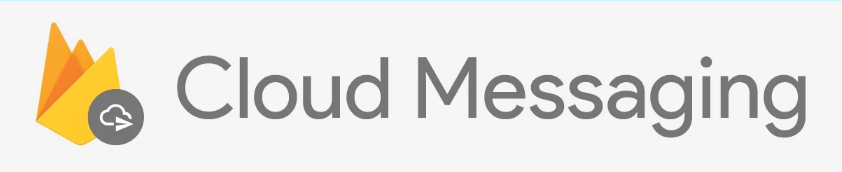
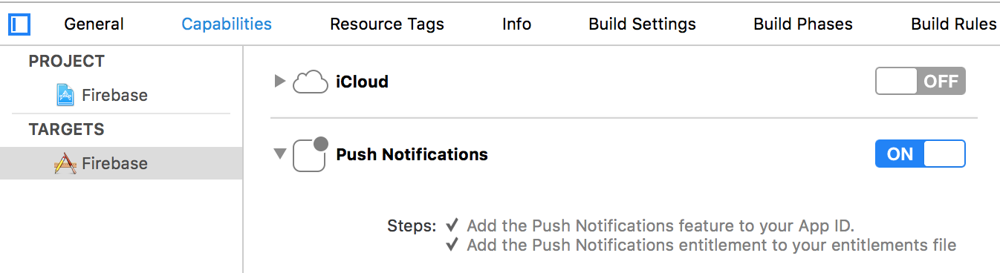
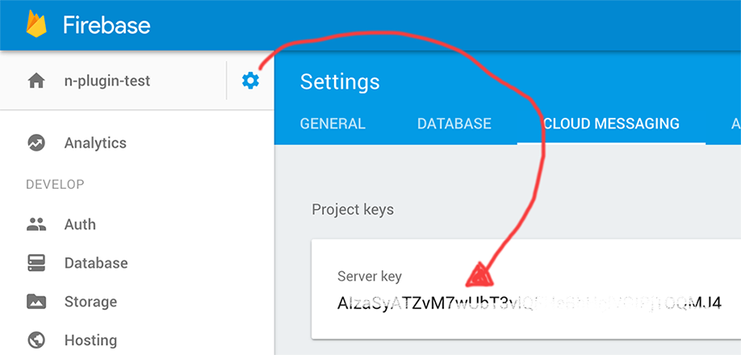

## Enabling Firebase Cloud Messaging (FCM)
Version 3.3.0 of this plugin added FCM support (which is the successor of GCM).

Although using push messages in your Firebase app is really easy setting it up is not. Traditionally, especially for iOS.

### Android
If you didn't choose this feature during installation you can uncomment `firebase-messaging` in [include.gradle](../platforms/android/include.gradle)

You will not get the title and body if the notification was received while the application was in the background, but you will get the *data* payload.

Add the following services in the `app/App_Resources/Android/AndroidManifest.xml` to enable advanced FCM messaging:
```
<manifest ... >
    <application ... >
        ...
        <service android:name="org.nativescript.plugins.firebase.MyFirebaseInstanceIDService">
            <intent-filter>
                <action android:name="com.google.firebase.INSTANCE_ID_EVENT"/>
            </intent-filter>
        </service>
        <service android:name="org.nativescript.plugins.firebase.MyFirebaseMessagingService">
            <intent-filter>
                <action android:name="com.google.firebase.MESSAGING_EVENT"/>
            </intent-filter>
        </service>
    </application>
</manifest>
```

### iOS
If you didn't choose this feature during installation you can run the "post install" script again (see the main readme) to add messaging support.

#### Enable push support in Xcode

Open /platforms/ios/yourproject.__xcworkspace__ (!) and go to your project's target and head over to "Capabilities" to toggle this switch:


> Without this enabled you will receive push messages in the foreground, but **NOT in the background** / when the app is killed.

#### Copy the entitlements file
The previous step created a the file`platforms/ios/YourAppName/(Resources/)YourAppName.entitlements`.
Copy that file to `app/App_Resources/iOS/` (if it doesn't exist yet, otherwise merge its contents),
so it's not removed when you remove and re-add the iOS platform. The relevant content for background push in that file is:

```xml
	<key>aps-environment</key>
	<string>development</string>
```

Since plugin version 3.11.0 the plugin will pick up that file during a build and integrates it with the built app
so you no longer need to continually manually enable push notifications in Xcode.

#### Allow processing when a background push is received
Open `app/App_Resources/iOS/Info.plist` and add this to the bottom:

```xml
<key>UIBackgroundModes</key>
<array>
  <string>remote-notification</string>
</array>
```

#### Cleanup an old script
Versions up to 3.9.2 of this plugin added the script `/hooks/after-prepare/firebase-install-ios-entitlements.js`, please remove it.

#### Provisioning hell
Follow [this guide](https://firebase.google.com/docs/cloud-messaging/ios/certs) to the letter. Once you've done it run `tns run ios` and upon starting the app it should prompt you for notification support. That also works on the simulator, but actually receiving notifications is _only_ possible on a real device.

### Handling a notification
To listen to received notifications while in the foreground or when your app moves from the background to the foreground, add a handler to `init`.

Any pending notifications (while your app was not in the foreground) will trigger the `onMessageReceivedCallback` handler.

##### JavaScript
```js
  firebase.init({
    onMessageReceivedCallback: function(message) {
      console.log("Title: " + message.title);
      console.log("Body: " + message.body);
      // if your server passed a custom property called 'foo', then do this:
      console.log("Value of 'foo': " + message.data.foo);
    }
  });
```

##### TypeScript
```js
  firebase.init({
    onMessageReceivedCallback: function(message: Message) {
      console.log(`Title: ${message.title}`);
      console.log(`Body: ${message.body}`);
      // if your server passed a custom property called 'foo', then do this:
      console.log(`Value of 'foo': ${message.data.foo}`);
    }
  });
```

You don't _have_ to provide the handler during `init` - you can also do it through a dedicated function.

One scenario where you want to do this is if you don't want the "This app wants to send push notifications" popup during init, but delay it until you call this function.

```js
  firebase.addOnMessageReceivedCallback(
    function(message) {
      // ..
    }
  );
```

### Pushing to individual devices
If you want to send push messages to individual devices, either from your own backend or the FCM console, you need the push token.

Similarly to the message callback you can either wire this through `init` or as a separate function:

```js
  firebase.init({
    onPushTokenReceivedCallback: function(token) {
      console.log("Firebase push token: " + token);
    }
  });
```

.. or:

```js
  firebase.addOnPushTokenReceivedCallback(
    function(token) {
      // ..
    }
  );
```

### Send messages to Topics
Based on the publish/subscribe model, FCM topic messaging allows you to send a message to multiple devices that have opted in to a particular topic. You compose topic messages as needed, and FCM handles routing and delivering the message reliably to the right devices.

Client apps can subscribe to any existing topic, or they can create a new topic. When a client app subscribes to a new topic name (one that does not already exist for your Firebase project), a new topic of that name is created in FCM and any client can subsequently subscribe to it.

```js
  firebase.subscribeToTopic("news");
```

and:

```js
  firebase.unsubscribeFromTopic("news");
```

## Testing
Using the Firebase Console gives you most flexibility, but you can quickly and easily test from the command line as well:

```
curl -X POST --header "Authorization: key=SERVER_KEY" --Header "Content-Type: application/json" https://fcm.googleapis.com/fcm/send -d "{\"notification\":{\"title\": \"My title\", \"text\": \"My text\", \"badge\": \"1\", \"sound\": \"default\"}, \"data\":{\"foo\":\"bar\"}, \"priority\": \"High\", \"to\": \"DEVICE_TOKEN\"}"
```

* SERVER_KEY: see below
* DEVICE_TOKEN: the one you got in `addOnPushTokenReceivedCallback` or `init`'s `onPushTokenReceivedCallback`

If you don't want a badge on the app icon, remove the `badge` property or set it to 0. Note that launching the app clears the badge anyway.


