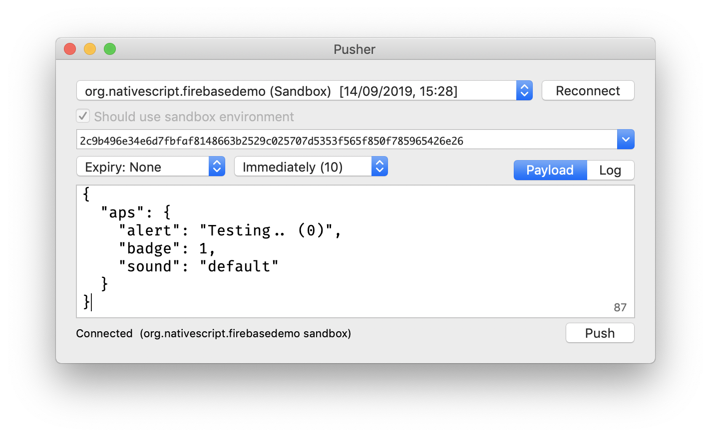
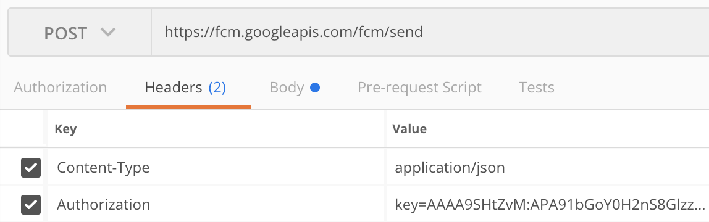
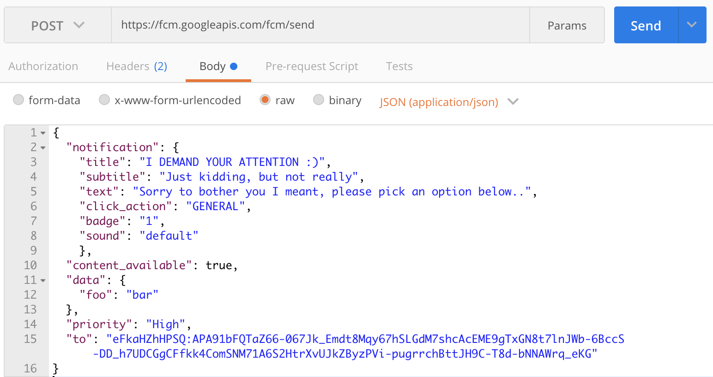

If you read this, chances are you want Push Notifications, but want to use a third-party push service instead of interfacing with Firebase Cloud Messaging directly.

You'll be 😃 to learn this plugin has a *lite* mode that won't add any native Firebase dependencies (or *Pod* libraries) on iOS, and only the bare necessities on Android (on Android, Push Messaging will always use FCM, regardless the push service) in case you only want to use an external push client.

Go to you app's root folder and remove `firebase.nativescript.json`, then run `npm i`. At one point you will be prompted `"Are you using this plugin as a Push Notification client for an external (NOT Firebase Cloud Messaging) Push service? (y/n)"` and answer `y`.

> ⚠️ Plugin version 10.1.0 removed support for the `external_messaging` property in `firebase.nativescript.json`. Please remove that file and re-run `npm i` if you had that hacky solution. 

## Demo app
I've tried applying best practices to a [dedicated push-only demo app](/demo-push).

## ⚠️ Important ⚠️
Two important things to keep in mind are:
- `require` (not `import`!) the plugin in [app.js/app.ts](https://github.com/EddyVerbruggen/nativescript-plugin-firebase/blob/e18e546ac1b96fea1d7ce71c5ae3453a8955cc17/demo-push/app/app.ts#L5) (or `main.ts`, or any other file that bootstraps your app).
- Show [your own consent screen](https://github.com/EddyVerbruggen/nativescript-plugin-firebase/blob/e18e546ac1b96fea1d7ce71c5ae3453a8955cc17/demo-push/app/push-view-model.ts#L33-L43) before iOS requests permission, because **a)** the default popup (that'll also still be shown) isn't very friendly/configurable, and **b)** once the user denies permission they have to go to the settings app as you app can only request permission once.

## Setup

> Do not run the plugin's `.init` function!

### Android
Open your Firebase project at the Google console and click 'Add app' to add an Android app. Follow the steps (make sure the bundle id is the same as your `nativescript.id` in `package.json` and you'll be able to download
`google-services.json` which you'll add to your NativeScript project at `app/App_Resources/Android/google-services.json`

There is a little quirk: you will currently not get the title and body if the notification was received while the application was in the background, but you will get the *data* payload.

### iOS

#### Enable push support in Xcode

Open /platforms/ios/yourproject.__xcworkspace__ (!) and go to your project's target and head over to "Capabilities" to switch this on (if it isn't already):


> Without this enabled you will receive push messages in the foreground, but **NOT in the background** / when the app is killed.

#### Copy the entitlements file
The previous step created a the file`platforms/ios/YourAppName/(Resources/)YourAppName.entitlements`.
Copy that file to `app/App_Resources/iOS/` (if it doesn't exist yet, otherwise merge its contents),
so it's not removed when you remove and re-add the iOS platform. The relevant content for background push in that file is:

```xml
	<key>aps-environment</key>
	<string>development</string>
```

> Note that the filename can either be `<YourAppName>.entitlements` or `app.entitlements`, where `YourAppName` is the iOS foldername, see the path above.

#### Configure push notifications in `Info.plist`
Tell the plugin to allow an external push provider by adding this to `App_Resources/iOS/Info.plist` (without this, the push token will always be `undefined`!):

```xml
<key>UseExternalPushProvider</key>
<true/>
```

And to allow processing when a background push is received, add this as well:

```xml
<key>UIBackgroundModes</key>
<array>
  <string>remote-notification</string>
</array>
```

The end result should look like [this](https://github.com/EddyVerbruggen/nativescript-plugin-firebase/blob/58d2792421be0d9c3d8fbdddd4abd6c782b30723/demo-push/app_resources/iOS/Info.plist#L46-L51).

#### 
## API

### `areNotificationsEnabled`
On both iOS and Android the user can disable notifications for your app.
If you want to check the current state of this setting, you can do:

```typescript
import { messaging, Message } from "nativescript-plugin-firebase/messaging";

console.log(`Notifications enabled? ${messaging.areNotificationsEnabled()}`);
```

### `registerForPushNotifications`
The easiest way to register for (receiving) push notifications is calling `registerForPushNotifications`, and passing in a few handlers:

```typescript
import { messaging, Message } from "nativescript-plugin-firebase/messaging";

messaging.registerForPushNotifications({
  onPushTokenReceivedCallback: (token: string): void => {
    console.log("Firebase plugin received a push token: " + token);
  },

  onMessageReceivedCallback: (message: Message) => {
    console.log("Push message received: " + message.title);
  },

  // Whether you want this plugin to automatically display the notifications or just notify the callback. Currently used on iOS only. Default true.
  showNotifications: true,

  // Whether you want this plugin to always handle the notifications when the app is in foreground. Currently used on iOS only. Default false.
  showNotificationsWhenInForeground: true
}).then(() => console.log("Registered for push"));
```

> Any pending notifications (while your app was not in the foreground) will trigger the `onMessageReceivedCallback` handler.

> With the `token` received in `onPushTokenReceivedCallback` you can send a notification to this device.


### `getCurrentPushToken`
If - for some reason - you need to manually retrieve the current push registration token of the device, you can do:

```typescript
import { messaging } from "nativescript-plugin-firebase/messaging";

messaging.getCurrentPushToken()
    .then(token => console.log(`Current push token: ${token}`));
```

### Interactive notifications (iOS only for now)
To register the app to receive interactive pushes you need to call `messaging.registerForInteractivePush(model)`.
And you may hook to the `model.onNotificationActionTakenCallback` callback to know what action the user took interacting with the notification.

Each action has either type `button` or `input`, and you can set `options` to do any or all of:
- Launch the app: `foreground`.
- Only allow the action when the device is unlocked: `authenticationRequired`.
- Make the text red to indicate something will be removed/deleted/killed: `destructive`.

Consider this example, where an interactive push notification is received which the user expands and picks the fourth option.
They then type their reply, and (because of how the action was configured) the app launches and captures the reply.

   

```typescript
import { messaging, Message } from "nativescript-plugin-firebase/messaging";

const model = new messaging.PushNotificationModel();
model.iosSettings = new messaging.IosPushSettings();
model.iosSettings.badge = false;
model.iosSettings.alert = true;

model.iosSettings.interactiveSettings = new messaging.IosInteractivePushSettings();
model.iosSettings.interactiveSettings.actions = [
  {
    identifier: "OPEN_ACTION",
    title: "Open the app (if closed)",
    options: messaging.IosInteractiveNotificationActionOptions.foreground
  },
  {
    identifier: "AUTH",
    title: "Open the app, but only if device is not locked with a passcode",
    options: messaging.IosInteractiveNotificationActionOptions.foreground | messaging.IosInteractiveNotificationActionOptions.authenticationRequired
  },
  {
    identifier: "INPUT_ACTION",
    title: "Tap to reply without opening the app",
    type: "input",
    submitLabel: "Fire!",
    placeholder: "Load the gun..."
  },
  {
    identifier: "INPUT_ACTION",
    title: "Tap to reply and open the app",
    options: messaging.IosInteractiveNotificationActionOptions.foreground,
    type: "input",
    submitLabel: "OK, send it",
    placeholder: "Type here, baby!"
  },
  {
    identifier: "DELETE_ACTION",
    title: "Delete without opening the app",
    options: messaging.IosInteractiveNotificationActionOptions.destructive
  }
];

model.iosSettings.interactiveSettings.categories = [{
  identifier: "GENERAL"
}];

model.onNotificationActionTakenCallback = (actionIdentifier: string, message: Message) => {
  console.log(`onNotificationActionTakenCallback fired! Message: ${JSON.stringify(message)}, Action taken: ${actionIdentifier}`);
};

messaging.registerForInteractivePush(model);
```

To send an interactive push, add the `"category"` property to the notification, with a value corresponding to the `category` defined in the model you've registered in the app.
The payload to trigger the notification in the screenshots above is:

```json
{
  "aps": {
    "alert": {
      "title": "Realtime Custom Push Notifications",
      "subtitle": "Now with iOS 10 support!",
      "body": "Add multimedia content to your notifications"
    },
    "sound": "default",
    "badge": 1,
    "category": "GENERAL",
    "showWhenInForeground": true,
    "data": {
      "foo": "bar"
    }
  }
}
```

> *IMPORTANT* Use the `click_action` only for push notifications on iOS. When such a message is tapped in the Android notification center the app WON'T be opened. This will probably be fixed in the future.


## Testing push notifications

### iOS
For testing notifications on iOS the easiest tool I found is [Pusher](https://github.com/noodlewerk/NWPusher):



### Android
For testing on Android I prefer using [Postman](https://www.getpostman.com/) to *POST* to the FCM REST API. Look at which headers you need to set, and how the payload needs to be added:

  
